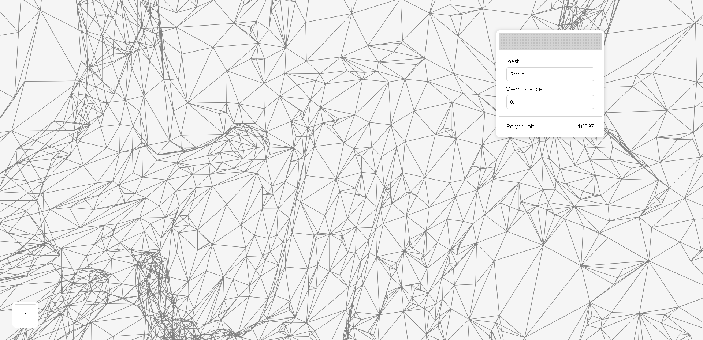

# Mesh preview

A wireframe visualizer for 3D meshes. For when you need convenient no-frills rendering of a handful of polygons - for instance, as part of a workflow of writing an importer for a mesh file format.

For interactive rendering, this app is currently not recommended when the polycount exceeds about 5000.

A live sample of the app can be found [here](https://www.tarpeeksihyvaesoft.com/experimental/mesh-preview/samples/obj-models/).

# Usage

You can find samples of usage in the [samples/](./samples/) directory.

It may be best to start by looking at the `minimal` sample, as it shows the bare minimum needed to get the app going.

## Interface

The app exposes only one function, `start_mesh_preview()`. This function can be imported from [src/start.js](src/start.js). The function takes as its argument a single object, whose properties define how the app should operate. The properties are documented in the table, below. (Note that not all of these properties need to be defined by the caller, as all of them have default values.)

| Property | Explanation |
| -------- | ----------- |
| meshesMetadata | An array of objects, where each object specifies the metadata of one mesh - e.g. `[{name: "Triangle"}, {name: "Square"}]`. Any meshes listed in this array will be made available for selection in the app's GUI; and on selection, the corresponding object will be passed to the **get_mesh_data** property. Each object must specify at least the *name* property. (A full documentation of the properties of this object will be made available later.) |
| get_mesh_data | A function that returns the polygons of the mesh that is to be currently rendered. The function receives as its only argument the element of the **meshesMetadata** property that refers to the mesh in question. The return value must be an array of arrays, where each sub-array defines one polygon and each of the sub-array's elements - objects - defines an XYZ vertex of that polygon. For example, `[[{x:0,y:0,z:0},{x:1,y:0,z:0}], [{x:0,y:0,z:0},{x:0,y:1,z:0},{x:1,y:1,z:0}]]` represents a line (2-gon) and a triangle (3-gon). |
| continuousRendering | A boolean that decides whether to keep redrawing the mesh at the screen's refresh rate (continuous rendering) or only when the user changes the view distance or chooses another mesh. Disabling continuous rendering can be useful when dealing with high-polycount meshes, where rendering a frame would take much more time than the refresh rate would allow. However, if this property  is set to *false*, the **rotationDelta** option will have no effect and the mesh won't rotate. |
| infoText | A string that will be shown in the app's bottom left corner. Could be e.g. mesh copyright information. |
| modulePath | The path to the app's source files relative to the current path. E.g. `"../src"` would indicate a 'src' folder in the parent directory. |
| containerId | The app runs in a container; this property defines the container's DOM id. Default: *"mesh-preview"*. |
| defaultOrientation | An array - [x y z] - defining the orientation to which the mesh will be angled for rendering. A value of [0 0 0] would mean no additional angling. The XYZ values are in radians. |
| rotationDelta | An array - [x y z] - defining the amount of rotation per frame to apply to the mesh on the corresponding XYZ axes. The XYZ values are in radians. If the **continuousRendering** property is set to *false*, this property will have no effect and the mesh won't rotate. |
| defaultViewDistance | The default distance from the camera at which to render the mesh. |
